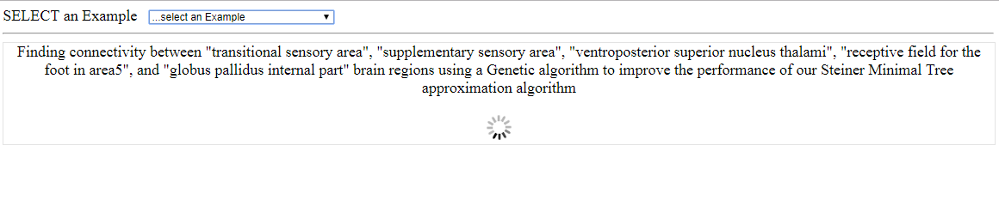
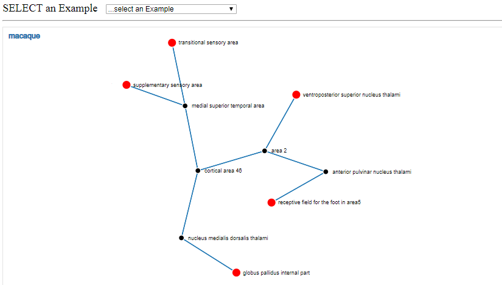

### Connected Brain Regions (SMT-Genetic)
SMT-Genetic is a web-based tool to find a connectivity path among a given set of brain regions. Specifically, this tool uses a genetic algorithm to find a better connectivity path among the brain regions than [SMT-Neurophysiology](https://github.com/dewancse/connected-brain-regions). This tool is deployed at this address: https://dewancse.github.io/SMT-Genetic/index.html

### Installing SMT-Genetic
Please do the following steps to install the SMT-Genetic in your workspace:

- `git clone https://github.com/dewancse/SMT-Genetic.git`
- `npm install` to install packages
- open `index.html` home page in the browser

### SMT-Genetic workflow
Genetic algorithm takes sometime to find a connectivity path among a given set of brain regions. For convenience, we have set up five examples in the form of a dropdown menu. Users can choose an example from the dropdown menu and wait for sometime to get the connectivity path among a set of brain regions.


*A screenshoot illustrating an execution of a GA example selected from the dropdown menu to get the connectivity path among a set of brain regions.*

Following output illustrates the connectivity path among a set of brain regions selected by the user from the dropdown menu.


*A screenshoot illustrating a connectivity path among a set of brain regions for the execution of a GA example selected from the dropdown menu. Here brain regions are connected by macaque species whose edge weight is 2 (see below), so total edge weight is 18. Red brain regions are required nodes (a given set of brain regions), whereas black brain regions are intermediate nodes (or non-required nodes) which help connect the required nodes.*

### Species weight
We have considered four species with an arbitrary weight value to represent edge weights. In the above example, the user can compute total weight by considering the following species weight:

| Species | Weight |
| --- | --- |
| `Homo sapiens` | `1` |
| `macaque` | `2` |
| `Rat` | `5` |
| `Birds` | `7` |

### Accessibility
The application is accessible by navigating::
```
  https://dewancse.github.io/SMT-Genetic/index.html
```

### Programming Language
- JavaScript

### Limitations
We will implement Unit testing and Functional testing to make sure the code is functioning as expected.

### List of contributors
- Syed Islam
- Dewan Sarwar

### Acknowledgements
This project is supported by the MedTech Centre of Research Excellence (MedTech CoRE), the Aotearoa Foundation, and the Auckland Bioengineering Institute.